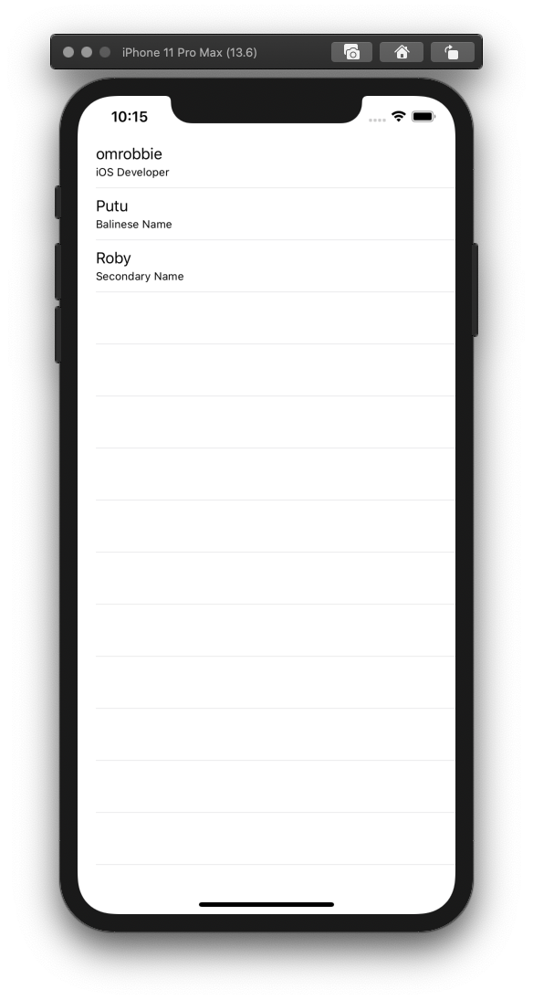

# ios-mvvc

This is an example of MVC with a separate handle for the View. The idea is to avoid the "Massive View Controller" idiom. So, Model only for Data, View only for Presentation, and ViewController only for Business Logic.

### Model
```
struct Model {

    let name: String
    let title: String
}
```

### View
```
protocol ViewDelegate: AnyObject {

    func didSelectRowAt(indexPath: IndexPath)
}

class View: UIView {

    @IBOutlet weak var tableView: UITableView!

    weak var delegate: ViewDelegate?

    var data = [Model]()
}

extension View: UITableViewDelegate, UITableViewDataSource {

    func tableView(_ tableView: UITableView, numberOfRowsInSection section: Int) -> Int {
        return data.count
    }

    func tableView(_ tableView: UITableView, cellForRowAt indexPath: IndexPath) -> UITableViewCell {
        let cell = UITableViewCell(style: .subtitle, reuseIdentifier: "cell")
        let item = data[indexPath.row]
        cell.textLabel?.text = item.name
        cell.detailTextLabel?.text = item.title
        return cell
    }

    func tableView(_ tableView: UITableView, didSelectRowAt indexPath: IndexPath) {
        tableView.deselectRow(at: indexPath, animated: true)
        delegate?.didSelectRowAt(indexPath: indexPath)
    }
}
```

### ViewController
```
class ViewController: UIViewController {

    @IBOutlet var homeView: View!

    override func viewDidLoad() {
        super.viewDidLoad()
        homeView.delegate = self
    }
}

extension ViewController: ViewDelegate {

    func didSelectRowAt(indexPath: IndexPath) {
        let item = homeView.data[indexPath.row]
        print("You are selected: \(item.name) - \(item.title)")
    }
}
```
